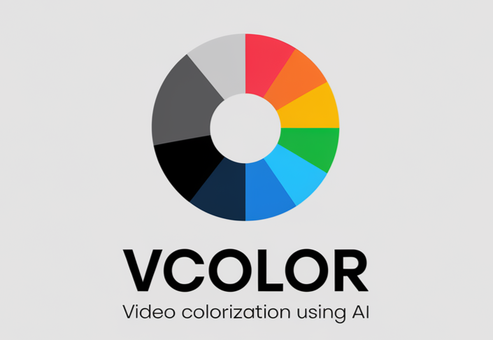

#vcolor

vcolor is a command-line tool for colorizing black-and-white videos using deep learning models.

## Features
- Supports two colorization models: ECCV16 and SIGGRAPH17.
- Can colorize individual frames or entire videos.
- GPU acceleration support with PyTorch.

## Installation
1. Clone the repository:
   git clone https://github.com/sallemiahmed/vcolor.git

2. Install dependencies:
   pip install -r requirements.txt

3. Run the tool:
   python3 tcolor.py -i input_video.mp4 -o output_video.mp4 -m eccv16 --use_gpu 

## Usage
```vcolor -i <input_video> -o <output_video> -m <model> [--use_gpu

Options:
  -i, --input     Path to the input video file (required).
  -o, --output   Path to the output video file (required).
  -m, --model    Colorization model to use (eccv16 or siggraph17).
  --use_gpu      Enable GPU acceleration if supported.
```

## Example Videos
### Original Black-and-White Video
<video width="320" height="240" controls>
  <source src="./videos/bw_video.mp4" type="video/mp4">
  Your browser does not support the video tag.
</video>

### Converted Color Video
<video width="320" height="240" controls>
  <source src="./videos/converted_video.mp4" type="video/mp4">
  Your browser does not support the video tag.
</video>

## Acknowledgments
The tcolor tool utilizes the [colorizeryp}(https://github.com/richzhang/colorization) package developed by Richard Zhang et al. The original code and models for EICU1 and SIGGRAPH17 colorization are provided by the authors.

## License
This project is licensed under the MIT License. Note that the colorizers package is subject to its own licensing terms as provided by the original authors.
